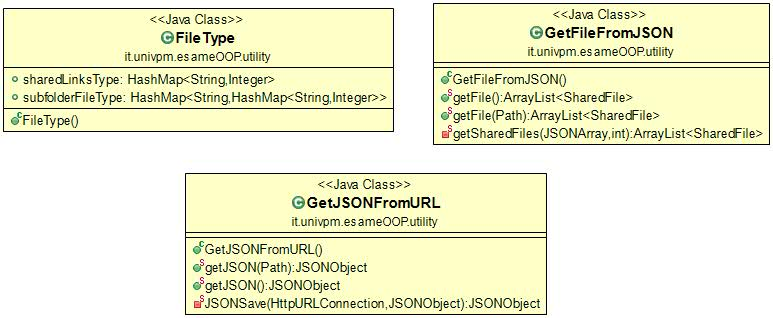
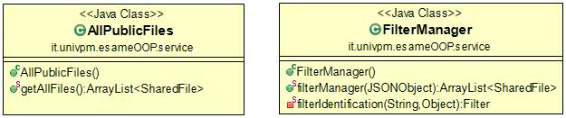
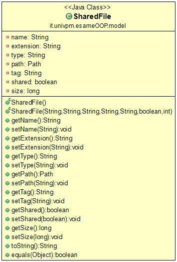
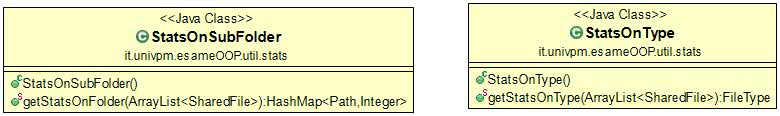
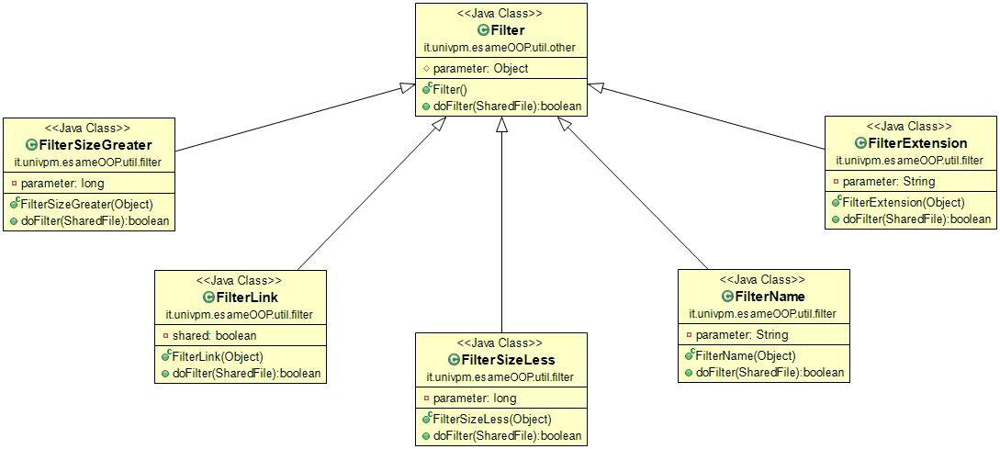
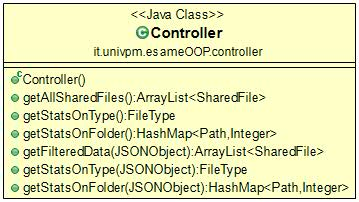
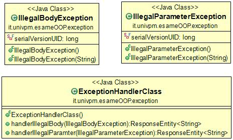

# esame-programmazione
Progetto per l'esame di programmazione ad oggetti, Università Politecnica delle Marche, Anno 2019/2020 

## Introduzione

Il seguente progetto è un Web Service che permette ad un client (es. Postman) di interagire con Dropbox ed eseguire, mediante REST API di tipo GET e POST, operazioni come:
* Visualizzare tutti i link condivisi in formato JSON
* Ottenere statistiche su tali dati
* Ottenere dati filtrati attarverso vari parametri
* Ottenere statistiche sui dati filtrati

Avendo utilizzato il framework SpringBoot, è possibile avviare il programma da un normale ambiente di sviluppo, come Eclipse, utilizzando l'opzione "Run as: SpringBoot App" per far partire in automatico un server Tomcat sulla porta 8080.

### Struttura dei dati
I dati sono strutturati mediante una serie di campi:
1. Nome del file/cartella
2. Percorso del file/cartella
3. Estensione del file
4. Tipo del file
5. Dimensione del file
6. Un attributo che distingue i file con link condiviso, dai file contenuti all'interno di una cartella con link condiviso (file accessibili ma senza link)

## Richieste
Tipo | Rotta | Funzione
---- | ---- | ----
`GET` | /data | Restituisce tutti i file con link condiviso e, per le cartelle con link condiviso, i file all'interno di tali cartelle
`GET` | /stats/type | Restituisce una statistica su tipo e quantità di file per tipo per i file con link condiviso, e su estensioni e quantità di estensioni per i file contenuti in cartelle condivise
`GET` | /stats/folder | Restituisce una statistica sulla quantità di link condivisi per sottocartella, nel caso in cui un file si trovi in un percorso con cartelle condivise, il file sarà conteggiato nella cartella condivisa più vicina, in mancanza di cartelle condivise sarà conteggiato nella propria cartella
`POST` | /data | Restituisce i file che soddisfano i requisiti del filtro utilizzato
`POST` | /stats/type | Restituisce la statistica sul tipo dei file che soddisfano i requisiti del filtro utilizzato
`POST` | /stats/folder | Restituisce la statistica sul tipo dei file che soddisfano i requisiti del filtro utilizzato

### Esempi
Un possibile esempio di risposta alla rotta `GET`    `/data` è:
```
    {
        "name": "Get Started with Dropbox.pdf",
        "extension": ".pdf",
        "type": "doc",
        "path": "file:///C:/get%20started%20with%20dropbox.pdf",
        "tag": "file",
        "shared": true,
        "size": 1102331
    }
```

Un esempio di risposta alla rotta `GET`   `/stats/type` è
```
{
    "sharedLinksType": {
        "folder": 4,
        "doc": 7,
        "text": 2,
        "video": 2
    },
    "subfolderFileType": {
        "Esercizio Parsing": {
            ".classpath": 2,
            ".project": 2,
            ".class": 1
        }
```
Dove sharedLinksType indica il tipo dei link condivisi, subfolderFileType indica le estensioni dei file contenuti all'interno della cartella indicata come nome dell'oggetto JSON

Un esempio di risposta alla rotta `GET`   `/stats/folder` è
```
{
    "\\università\\anno ii\\secondo semestre\\programmazione a oggetti": 1,
    "\\università\\anno ii\\secondo semestre\\programmazione a oggetti\\esercizi\\esercizio parsing\\.settings": 1,
    "\\università\\anno ii\\secondo semestre\\programmazione a oggetti\\dispense e manuali-20200304": 2,
    "\\università\\anno ii\\secondo semestre\\programmazione a oggetti\\slide\\spring": 2,
}
```

## Filtri
La tabella mostra i filtri disponibili sui dati considerati:

Operatore | Descrizione | Esempio di utilizzo
---- | ---- | ----
name | Restituisce tutti i file con il nome considerato o all'interno di cartelle con il nome considerato | {"filter":[{"name":"esercizio parsing"}]}
extension | Restituisce tutti i file con estensione ricercata | {"filter":[{"extension":".txt"}]}
shared | Se true restituisce solo i file con link condiviso, se false restituisce tutti i file accessibili dall'esterno | {"filter":[{"shared":true}]}
size | Restituisce tutti i file con dimensione maggiore (o minore) di un certo numero | {"filter":[{"size":{"greater":1000}}]}

E' possibile concatenare più filtri attraverso gli operatori condizionali   `and`    e     `or`     ad esempio :
```
{
    "filter" : [
        { "name" : "esercizio parsing",
          "operator" : "and" 
},
        { "extension" : ".java" }
    ]
}
```

 

## Diagrammi Uml
### Diagramma dei casi d'uso

 


### Packages


### Diagrammi delle classi

#### it.univpm.esameOOP.utility



#### it.univpm.esameOOP.service



#### it.univpm.esameOOP.model



#### it.univpm.esameOOP.util.stats



#### it.univpm.esameOOP.util.filter



#### it.univpm.esameOOP.controller



#### it.univpm.esameOOP.exception



### Diagrammi delle sequenze 

#### GET /data


#### GET /stats/type


#### GET /stats/folder


#### POST /data


#### POST /stats/type


#### POST /stats/folder


## Autori
**Pilone Fabrizio** : https://github.com/fabriziopilone

**Sprecacè Alexia** : https://github.com/AlexiaSprecace
